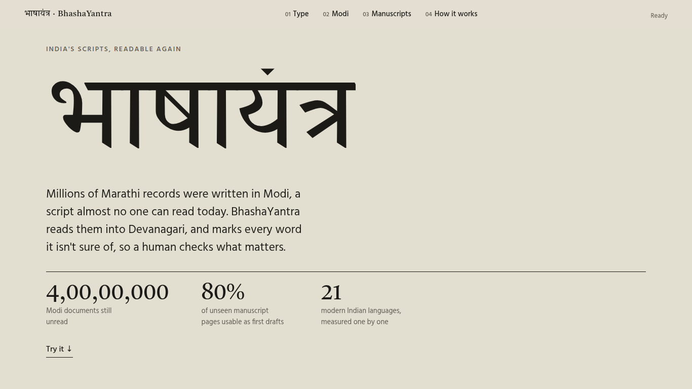
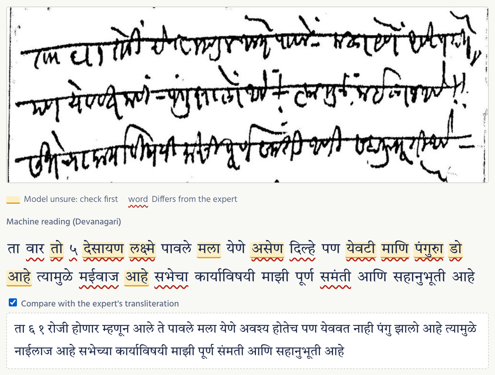
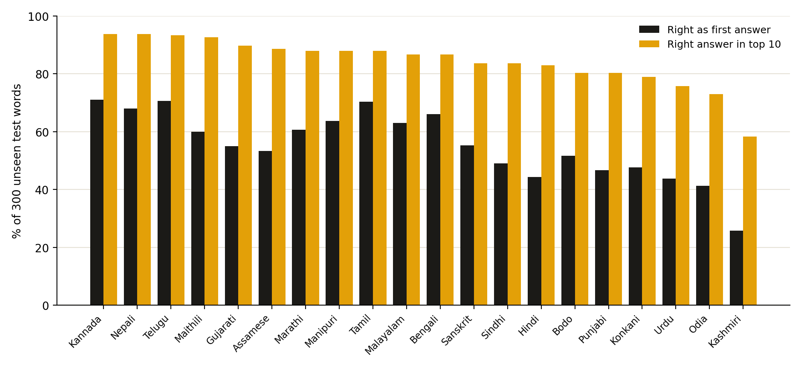
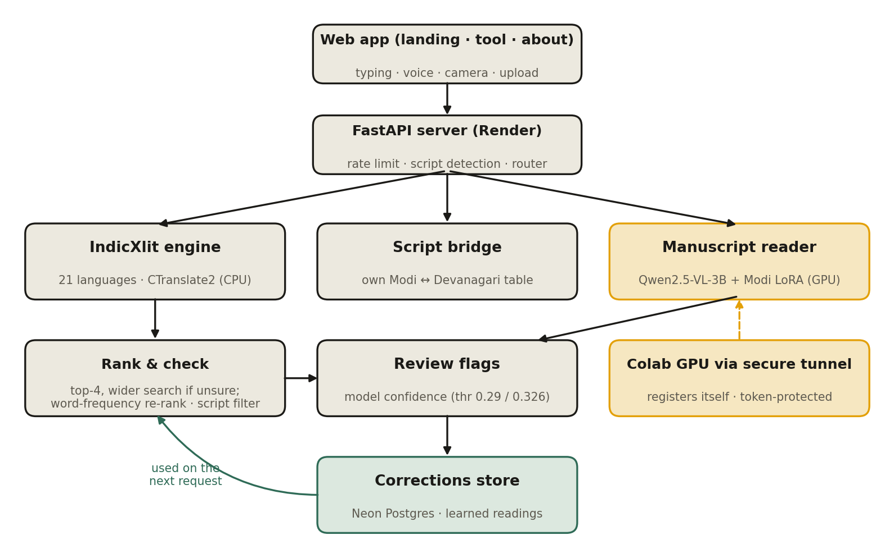

# भाषायंत्र · BhashaYantra

**Making India's historical scripts readable, starting with Modi.**

BhashaYantra reads handwritten Modi manuscripts, Modi text and 21 modern Indian languages into a script people can read, and marks every word it isn't sure of, so a human checks what matters.

**[Try it live →](https://bhashayantra.onrender.com)** · [Demo video](#) <!-- add YouTube link --> · [How we measured it](https://bhashayantra.onrender.com/about) · [Research notes](research/)

*Smart India Hackathon 2026 · Student Innovation · Heritage & Culture · Team DeepThink, RAIT Navi Mumbai*



> The live site runs on a free server: the first visit after a quiet period can take up to a minute to wake up.

---

## Why

Modi was the everyday script of Marathi administration for centuries. An estimated **4 crore (40 million) Modi documents**, including land grants, court records and letters, are still untranscribed, and only a few experts can read them. The language is still spoken; the script is no longer taught.

BhashaYantra **transliterates**: it changes the script, not the language. Marathi in Modi becomes Marathi in Devanagari, so any Marathi reader can understand it, with the original wording intact.

## What it does

| | Feature | Status |
|---|---|---|
| 📜 | **Handwritten Modi pages → Devanagari**, with unsure words marked for review | ✅ Gallery of real unseen pages; live upload when the GPU reader is running |
| 🔁 | **Modi ⇄ Devanagari text**, exact and round-trip tested | ✅ Live |
| 🎤 📷 | **Speak Marathi or Hindi**, or photograph printed text, and see it in Modi | ✅ Live (Chrome/Edge for voice) |
| ⌨️ | **21 Indian languages** from romanised typing ("kal subah…") | ✅ Live |
| 🟨 | **Review flags** on every word, with a calibrated threshold | ✅ Live |
| 🧠 | **Learns from corrections**, with safeguards against misuse | ✅ Live (Postgres) |


*A held-out Modi page: the machine reading, words the model is unsure of in yellow, differences from the expert in red, and the expert's reading below.*

## Results

Everything is measured on data the system had never seen.

**Handwritten Modi (60 held-out pages from the model author's test list)**

| Metric | Result |
|---|---|
| Character error rate | **0.31** |
| Pages usable as a first draft (CER ≤ 0.40) | **80%** |
| Flagged words that are really wrong | **89%** (vs 64% of all words) |
| Image clean-up (binarise/deskew) | Made it worse (0.33): we use raw scans, and clean only to break loops |

**Typed text (300 unseen words × 20 languages, Aksharantar test split, measured through the live app's code path)**

| Metric | Result |
|---|---|
| Right as first answer (average) | **55.4%** (raw model: 54.0%) |
| Right answer among the top 10 | **84.3%** |
| Biggest gains from our ranking | Bengali +13.0, Tamil +8.3, Urdu +4.4 points |
| Flagged words that are really wrong | **67.8%** (vs 44.6% baseline) |



**Findings from testing**
1. A standard library corrupts Modi (श्री → श्ॠ); our own mapping round-trips exactly.
2. The public IndicXlit conversion we use had **Bengali and Assamese tags swapped**; fixing it lifted Bengali from 8.7% to 66%.
3. Aksharantar's test words share **0.0% overlap** with its training words, so all scores are on unseen words.
4. Searching wider **only for unsure words** keeps the app fast with no loss in accuracy.

Exact-match scoring is strict (valid spelling variants count as wrong), so real accuracy is somewhat higher.

## How it works



1. **Detect the script** from Unicode blocks (including Modi, Sharada, Grantha, Kaithi, Brahmi, Nandinagari).
2. **Route** to the right engine: IndicXlit (CTranslate2, CPU) for romanised text; our verified table for Modi text; an open vision-language model for handwritten pages.
3. **Rank and check:** top-4 candidates per word, a wider search over 10 only for unsure words, word-frequency re-ranking, and a filter for letters from the wrong script.
4. **Flag doubts** using the model's own confidence, with the threshold chosen on validation data and confirmed on test data.
5. **Learn safely:** a correction is reused immediately only if the model itself proposed it; anything else needs two people to agree.

The manuscript model needs a GPU. A Colab notebook runs it on a free GPU, opens a secure Cloudflare link, and **registers itself** with the site using a secret token. Uploaded photos are processed and not stored.

## Tech stack

Python 3.12 · FastAPI · CTranslate2 (IndicXlit) · Qwen2.5-VL-3B + Modi LoRA (4-bit, Colab T4) · wordfreq · Neon Postgres · Render · HTML/CSS/JS · Web Speech API · Tesseract.js

## Run it locally

```bash
git clone https://github.com/anushkak270706-bot/bhashayantra.git
cd bhashayantra
py -3.12 -m venv .venv            # macOS/Linux: python3.12 -m venv .venv
.venv\Scripts\Activate.ps1        # macOS/Linux: source .venv/bin/activate
pip install -r requirements.txt
python -m pytest -q backend/tests
uvicorn backend.main:app --reload
```

Open http://127.0.0.1:8000. The first start downloads the transliteration model. Locally, corrections are saved to `backend/data/corrections.jsonl`.

## Deploy (Render)

| Setting | Value |
|---|---|
| Build command | `pip install -r requirements-deploy.txt && python -c "from huggingface_hub import snapshot_download; snapshot_download('Singla0009/all-indic-transliteration', allow_patterns='indicxlit_ct2_fp32/*')"` |
| Start command | `uvicorn backend.main:app --host 0.0.0.0 --port $PORT` |

| Environment variable | Purpose |
|---|---|
| `PYTHON_VERSION` | `3.12.8` |
| `BHASHAYANTRA_LANG_DETECT` | `off` on small servers (skips the 269 MB language-detection model) |
| `HF_HOME` | `/opt/render/project/src/.hf_cache` (model cached at build time) |
| `DATABASE_URL` | Postgres connection string (corrections, learned readings) |
| `MANUSCRIPT_GPU_TOKEN` | Secret shared with the Colab GPU reader |

Never commit these values.

**Live manuscript reading:** open `notebooks/BhashaYantra_GPU_Server.ipynb` in Colab with a T4 GPU, set `TOKEN` to the same value as `MANUSCRIPT_GPU_TOKEN`, and run all. The Manuscripts tab shows **GPU online** while it runs.

## Reproduce the numbers

```bash
python -m eval.evaluate --all --n 300 --app                   # typed text, as the live app runs
python -m eval.evaluate --all --n 300 --split valid --sweep   # choose the flag threshold
python -m eval.overlap                                         # train/test word overlap
```
Manuscripts: `notebooks/BhashaYantra_Manuscripts.ipynb` on a Colab T4 GPU. Results are saved in `eval/results/`.

## Project structure

```
backend/
  main.py                  API and page routes
  engines/                 IndicXlit engine, script bridge, Modi mapping, router
  services/                transliterator, ranking & flags, script filter, corrections store,
                           GPU bridge, rate limiter, script/language detection
  static/                  landing.html, index.html (tool), about.html, site.css, manuscript gallery
  tests/                   Modi mapping and script bridge tests
eval/                      evaluation scripts and results
notebooks/                 Colab notebooks: manuscript evaluation, live GPU reader
research/                  papers, datasets and models we build on
docs/images/               README images
```

## Limitations

- Word-by-word transliteration can't use sentence context (*main* → मैं or में); alternatives are one click away.
- Live manuscript upload works only while the GPU session runs; permanent GPU hosting is the next step.
- At a character error rate of 0.31, an expert still reviews each page; flags prioritise that review, they don't replace it.
- Frequency re-ranking currently covers Hindi, Bengali, Tamil and Urdu.

## Roadmap

Hosted GPU and batch processing · reviewer accounts for archives · fine-tuning on expert corrections · sentence-level ranking · more historical scripts (Sharada, Grantha, Kaithi) · search across transcribed collections · a timed study with Modi experts.

## Built on

- **IndicXlit & Aksharantar**: AI4Bharat (Madhani et al., 2023)
- **MoDeTrans & MoScNet**: Kausadikar et al., IIT Roorkee (ICDAR 2025)
- **lgtk/qwen25vl-3b-modi-synth-lora**: S. Godse (Apache-2.0), on Qwen2.5-VL-3B
- **wordfreq** (R. Speer) · **CTranslate2** (OpenNMT) · **indic_transliteration** · **Tesseract.js** · Unicode Modi block (U+11600–1165F)

Full references and notes: [`research/`](research/). Each model and dataset keeps its own licence.

## Team DeepThink

<!-- Names and roles -->
- [Name]: [role]
- [Name]: [role]

Ramrao Adik Institute of Technology (RAIT), Navi Mumbai · Smart India Hackathon 2026

## Licence

<!-- Choose one, e.g. MIT, and add a LICENSE file. Third-party models and data keep their own licences. -->
